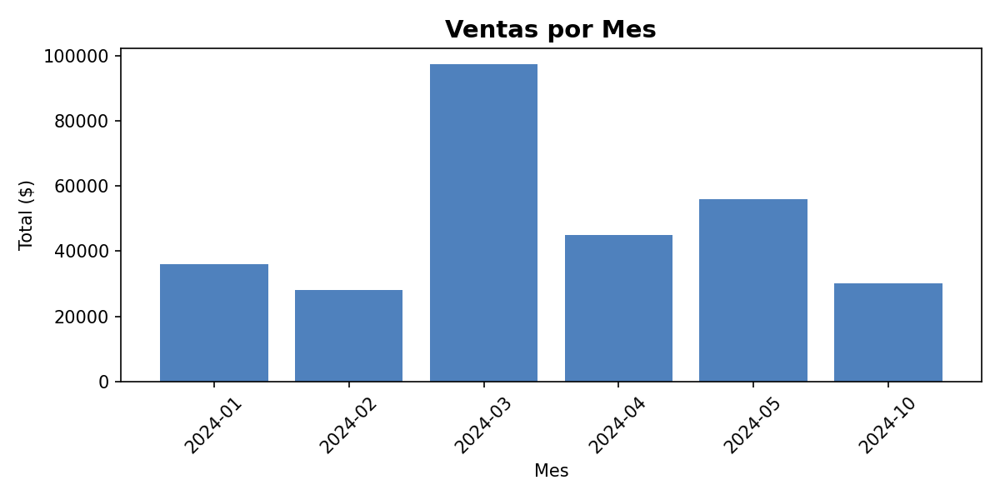

# 📊 Reporte Automático de Ventas para PyMEs

## ¿Qué problema resuelve?
Las PyMEs suelen registrar sus ventas en Excel de forma manual y desordenada:
fechas en distintos formatos, nombres inconsistentes, celdas vacías.
Este script transforma ese Excel en un reporte profesional en segundos.

## ¿Qué hace?
- ✅ Limpia fechas en múltiples formatos
- ✅ Estandariza nombres de clientes y productos
- ✅ Calcula ventas totales, ticket promedio y transacciones
- ✅ Identifica los productos más vendidos
- ✅ Muestra los clientes más frecuentes
- ✅ Genera un gráfico de ventas por mes
- ✅ Entrega todo en un Excel prolijo con 4 hojas

## Tecnologías
Python · pandas · openpyxl · matplotlib

## Vista previa del resultado


## ¿Cómo usarlo?
1. Cloná el repositorio
2. Instalá las dependencias: `pip install pandas openpyxl matplotlib`
3. Reemplazá `ventas_raw.xlsx` con tus datos
4. Ejecutá: `python reporte.py`
5. El reporte se genera automáticamente como `reporte_ventas_final.xlsx`

## Caso de uso
Desarrollado como solución para PyMEs argentinas que necesitan
transformar datos crudos de ventas en reportes ejecutivos sin
conocimientos técnicos.
```
